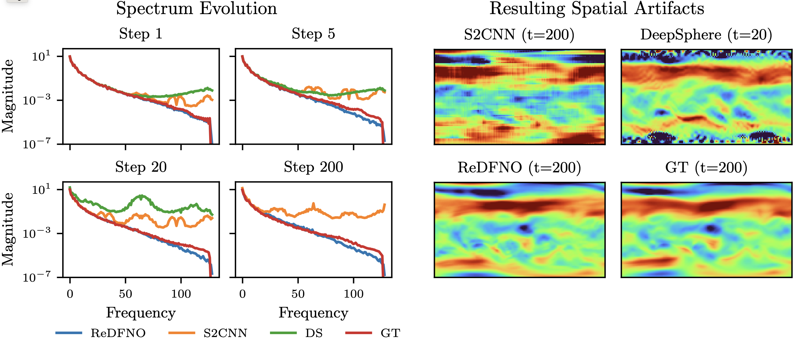

# Towards Stability of Autoregressive Neural Operators

Repository for our TMLR paper "Towards Stability of Autoregressive Neural Operators". 

Neural operators have emerged as one of the most important innovations in recent SciML, but these methods often develop stability issues
limiting their use for long-term, high resolution forecasts. Today, these stability issues are often addressed through reduced spectral
resolution. This is essentially equivalent to solving at reduced spatial resolution and resampling the underlying basis functions. We explore
methods to address this without sacrificing resolution. 



We explore the origins of these stability issues and how they manifest on problems ranging from simplified versions of common Neural Operator test cases to some of the 
most challenging problems that neural operators are used on today. We propose an approach for restructuring FNO-type architectures so that they can learn to mitigate these issues.

<p float="left">
  
   
</p>


This repository contains the code for reproducing section 3.1 and 5.1 from our paper. The main repository contains the code 
for 5.1. 3.1 is contained in the ns_experiments folder. **The code for 5.1 is a bit messy due to being cut out from a larger repo. Due to the simplicity of the 3.1 task, the code there is likely easier
to parse for getting a better understanding of our approach.**

## Data

The rotating Shallow Water Equation system can be generated through the following process: Note that the full dataset once generated is ~300 GB. We include the IC samples which are randomly sampled values of Z500, U500, V500 from the ERA5 dataset in the data_stubs directory along with means/stds used for normalization. The split used is (0-24/25-27/28-30). [Dedalus3](https://github.com/DedalusProject/dedalus) must be installed to execute this code as it is used to generate the data:

```
python data_process/gen_SWE_from_ic_file.py --ic_file=$ic_file --output_dir=$output_dir
```
Note that this was configured for running multiple processes in parallel through a third-party controller. The data must then be interpolated onto the correct grid:
```
python data_process/fix_swe_data.py --data_root=$data_root
```


## Training:

The config options can be set in the config file. Example SWE and ERA5 configs can be bound in the config directory. Note
that the branch that built this repository was configured for SWE specifically. Navier-Stokes code can be found in the corresponding sub-directory.

example training launch script for a single gpu job:
```
python train.py --enable_amp --yaml_config=$config_file --config=$config --run_num=$run_num
```


## Inference:

example inference launch script for a single gpu job:
```
python inference/inference.py --config $config --run_num $run_num
```
The inference script will use the last saved checkpoint corresponding to the config and run number to generate trajectories from multiple initial conditions in the validation dataset

The number of initial conditions and the length of the trajectories to be generated can be specified in the config file


---

If you found the code or ideas in our work useful, please consider citing:
```
@article{
mccabe2023towards,
title={Towards Stability of Autoregressive Neural Operators},
author={Michael McCabe and Peter Harrington and Shashank Subramanian and Jed Brown},
journal={Transactions on Machine Learning Research},
issn={2835-8856},
year={2023},
url={https://openreview.net/forum?id=RFfUUtKYOG},
note={}
}
```


